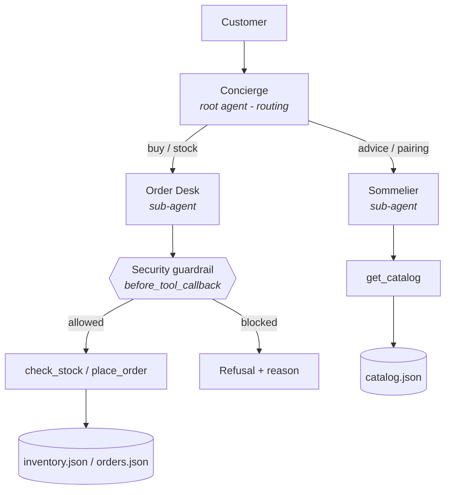

# Garrafeira Bali 🍷

**A multi-agent AI storefront that runs a one-person Portuguese wine business in Bali.**

Capstone project for Kaggle's *5-Day AI Agents: Intensive Vibe Coding Course with Google* — Track: **Agents for Business**.

---

## The problem

Garrafeira Bali is a (fictional but realistic) micro-business: one person importing and selling **3 Portuguese wines** online in Bali. Every sale requires the same repetitive conversation — recommend a wine, answer pairing questions, check stock, verify the customer is of legal drinking age (21+ in Indonesia), cap the order size, take the delivery details, and log the order. For a solo founder, answering chats *is* the business, and it doesn't scale past their waking hours.

## The solution

A small team of AI agents that acts as the shop's staff, available 24/7:

- **Concierge** (root agent) — greets customers and routes each request.
- **Sommelier** (sub-agent) — recommends among the 3 wines using the live catalog; handles taste, pairing and price questions.
- **Order Desk** (sub-agent) — checks stock and places orders, **supervised by a deterministic security guardrail** that vetoes any sale violating shop policy (no age confirmation, more than 12 bottles, malformed input), no matter what the LLM says.

## Architecture



Data flows through three small JSON files — a deliberately simple "database" so the whole business fits in one repo and the agent logic stays the star of the show.

## Course concepts demonstrated (3+)

| Course concept | Where to see it |
| --- | --- |
| **Multi-agent system (ADK)** | `garrafeira/agent.py` — root agent + 2 specialised sub-agents with `sub_agents=[...]` routing |
| **Security features** | `garrafeira/guardrails.py` — a `before_tool_callback` enforcing the 21+ age gate, a 12-bottle cap and input validation in deterministic Python; secrets isolated in `.env` |
| **Agent skills (Agents CLI)** | `skills/wine-shop-ops/SKILL.md` — the domain skill used during development so every vibe-coding session shared the same business rules |
| **Antigravity** (bonus) | The entire project was vibe-coded in Google Antigravity — shown in the submission video |

## Project structure

```
garrafeira-bali/
├── garrafeira/
│   ├── __init__.py       # exposes root_agent for `adk run` / `adk web`
│   ├── agent.py          # concierge + sommelier + order_desk agents
│   ├── tools.py          # get_catalog, check_stock, place_order
│   ├── guardrails.py     # security policies (before_tool_callback)
│   └── data/
│       ├── catalog.json  # the 3 wines
│       └── inventory.json
├── skills/wine-shop-ops/SKILL.md
├── requirements.txt
├── .env.example          # never commit a real .env
└── README.md
```

## Setup & run

Requirements: Python 3.10+, a free Google AI Studio API key.

```bash
git clone https://github.com/<your-username>/garrafeira-bali.git
cd garrafeira-bali

python -m venv .venv
source .venv/bin/activate        # Windows: .venv\Scripts\activate

pip install -r requirements.txt

cp .env.example .env             # then paste your GOOGLE_API_KEY into .env
```

Run in the terminal:

```bash
adk run garrafeira
```

Or with the ADK developer web UI (recommended — you can watch the agent transfers and guardrail events):

```bash
adk web
# open http://localhost:8000 and pick "garrafeira"
```

## Try these conversations

1. *"Something light for grilled fish on a hot afternoon?"* → Concierge routes to the **Sommelier**, who recommends the Vinho Verde from the catalog.
2. *"I'll take 2 bottles, I'm Rui in Canggu, and yes I'm over 21."* → **Order Desk** checks stock, confirms the total in IDR, places the order, and stock decrements in `inventory.json`.
3. *"Actually make it 50 bottles."* → The **guardrail blocks** the tool call; the agent explains the 12-bottle policy.
4. *(Refuse to confirm your age)* → The guardrail blocks the order until the customer confirms being 21+.

## Security notes

- No API keys or passwords anywhere in the code — configuration is via `.env` (git-ignored), with a safe `.env.example` template.
- Compliance rules live in `guardrails.py` as code, not prompts: prompt injection or model error cannot bypass them, because the callback runs before any tool executes and can veto the call.

## License

CC-BY 4.0 (per competition winner-license terms).
